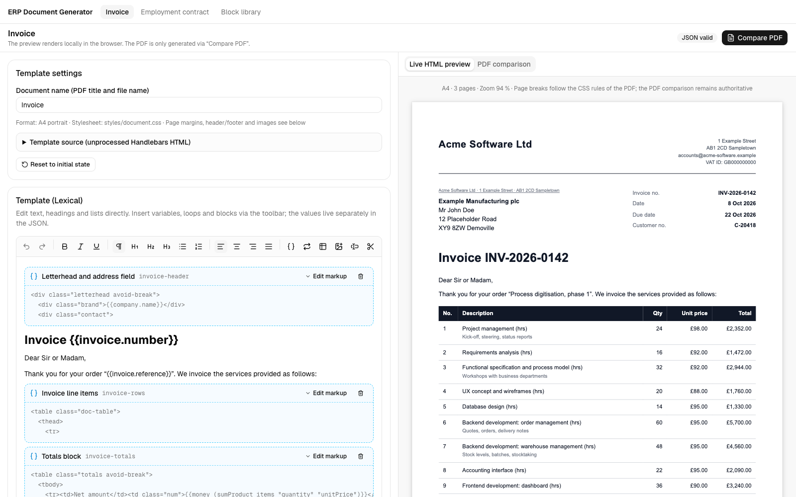
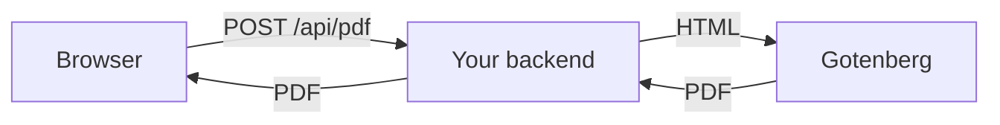
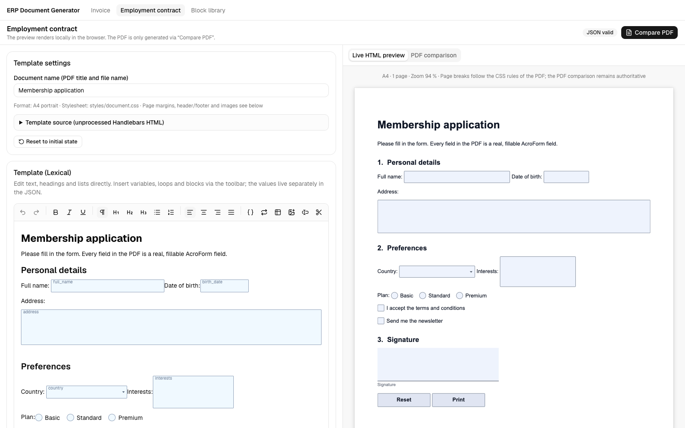
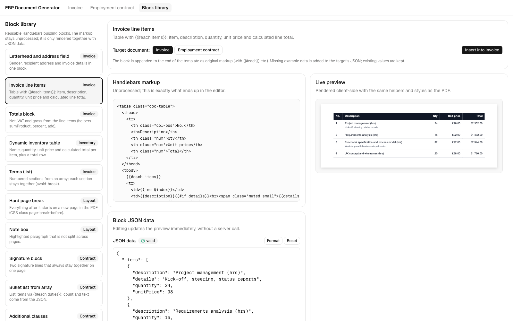
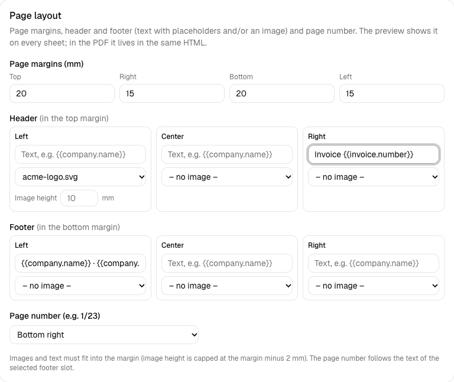

[](https://github.com/40ants/ai-badges)

> **This is a prototype, use with discretion.** This project was built with the help of AI as a small proof of concept. The code may look a bit rough in places, and the API may still change. It is actively maintained and under continuous development. Please review the code, test it against your own requirements and pin the version before using it in production.


# docgen-kit

Template-driven PDF documents for the web: write a **Handlebars** template, preview it live as real A4 sheets in the browser, render the PDF on the server with **Gotenberg** (headless Chromium) and optionally add **fillable AcroForm fields** with pdf-lib.

The library is framework-agnostic and split into four entry points, so you only pull in what you need. The [`demo/`](demo) folder is a complete Next.js application built on top of it (editor, block library, page layout, form fields).



> **Note on sample data:** all names, companies, addresses, e-mail addresses, bank details and other data in the demo and in the screenshots are **fictional** and were made up for demonstration. Any resemblance to real persons (living or dead), companies or other entities is entirely coincidental and unintended. See [Disclaimer](#disclaimer).

**Contributions are welcome.** Pull requests, bug reports and ideas are happily accepted. Run `npm run check` before opening a PR; for larger changes, please open an issue first so we can talk it through.


## Why

- **Your data stays yours (GDPR, data sovereignty).** Many SaaS document tools are a poor fit for strict privacy rules, because contracts, invoices and HR documents would have to leave the building. docgen-kit is a library, not a service: the preview runs in the browser, the PDF is rendered by a Gotenberg container on your own infrastructure (even air-gapped), and the library makes no outbound calls, collects no telemetry and needs no account or API key. That keeps audits and data-residency requirements manageable. (Compliance still depends on how you operate it; this is not legal advice.)
- **Easy React integration for simple use cases.** Built with a self-developed ERP in mind: drop in `DocumentPreview` and the editor, add one server endpoint, and you have live preview and PDF download without assembling a rendering pipeline yourself. Convenience first, with the framework-agnostic core underneath if you need more.
- **One HTML, one engine.** The preview and the PDF come from the same template, the same data and the same stylesheet. Chromium renders both, so page breaks, margins, header/footer and page numbers match.
- **Template and data are separate.** Templates hold markup and `{{placeholders}}`, values live in plain JSON.
- **Real pagination in the browser.** The preview builds individual A4 sheets with the same break rules as printing, including repeated table headers.
- **Fillable PDFs.** Text fields, checkboxes, radio groups, dropdowns, list boxes, signature fields and buttons are positioned by the layout itself (no coordinates to maintain).
- **Small surface, no lock-in.** Plain functions and a web-standard request handler. The PDF engine sits behind a one-method interface.

## Requirements

docgen-kit needs two things at runtime: a Node.js backend and a Gotenberg instance that renders the PDFs. Everything else is optional and depends on which features you use.

### Dependencies

- **Node.js ≥ 20** (or Bun, Deno or any runtime with the Fetch API) for the backend. I'm using it with NestJS (see below for [an example](#nestjs)); any Node framework works.
- **A Gotenberg 8 instance**, the only external service. The library talks to nothing else. Run it yourself, for example with Docker:

  ```bash
  docker run -d --name gotenberg -p 3011:3000 gotenberg/gotenberg:8 \
    gotenberg \
    --chromium-disable-javascript=true \
    --chromium-deny-private-ips=true \
    --api-timeout=30s
  curl http://localhost:3011/health
  ```

  - Point the library at its base URL (e.g. `http://localhost:3011`).
  - Do not publish the port like in this example outside of local development; see below.
  - The flags disable JavaScript in templates and block requests to private IP ranges (SSRF protection).
  - Plan for roughly 1 GB of RAM, since it runs headless Chromium.
- **Fonts:** Chromium inside Gotenberg renders the PDF, so fonts used by your templates must be available there (embedded via `@font-face` with inline data, or installed in a custom Gotenberg image). Otherwise a fallback font is used.
- **npm packages:** `handlebars` is installed automatically; the optional peer dependencies per feature are listed under [Install](#install).
- **Developing this repo:** Node ≥ 20, npm and Docker (for the demo's Gotenberg container).

### How the pieces fit together

The browser calls an endpoint of your own backend, and the backend asks Gotenberg to render the PDF. The browser never reaches Gotenberg, so keep it on a private network (firewall or shared Docker network) and expose only your backend.



## Install

> **docgen-kit is not on npm yet.** Until it is published, clone the repository, build it (`npm install && npm run build`) and install it from the local folder: `npm install /path/to/docgen-kit`. The commands below show the intended usage once it is published.

```bash
npm install docgen-kit
```

| Entry point | Runs in | Contents | Optional peer dependencies |
| --- | --- | --- | --- |
| `docgen-kit` | browser, Node, edge | Template engine, `renderDocument`, page layout, assets, form-field definitions, block presets, default stylesheet | – |
| `docgen-kit/server` | Node ≥ 20, Bun, Deno, edge (Fetch API) | `createPdfService`, Gotenberg renderer, web-standard request handler, AcroForm generation | `pdf-lib` (only for form fields) |
| `docgen-kit/client` | browser | Preview pagination, image upload processing, localStorage document store, `fetchPdf` | – |
| `docgen-kit/react` | browser (React 19) | Lexical nodes, HTML import/export, sync plugin, `DocumentPreview`, pluggable node views | `react`, `lexical`, `@lexical/html`, `@lexical/react` |
| `docgen-kit/styles.css` | – | The default document stylesheet as a CSS file | – |

## Quick start

A step-by-step walkthrough with Express and React (preview, editor, images, form fields, persistence) is in the [Express + React guide](docs/guide-express-react.md). The essentials:

### 1. PDF endpoint (server)

```ts
import { createGotenbergRenderer, createPdfRequestHandler, createPdfService } from "docgen-kit/server";

const service = createPdfService({
  renderer: createGotenbergRenderer({ url: process.env.GOTENBERG_URL }), // default: http://localhost:3011
});

// Next.js route handler, Hono, Bun, Deno, Cloudflare Workers, ...: anything that speaks (Request) => Response.
export const POST = createPdfRequestHandler(service);
```

Start Gotenberg (`docker run --rm -p 3011:3000 gotenberg/gotenberg:8 gotenberg --chromium-disable-javascript=true --chromium-deny-private-ips=true`), then:

```bash
curl -X POST http://localhost:3000/api/pdf -H "Content-Type: application/json" \
  -d '{"template":"<h1>Invoice {{no}}</h1><p>Total: {{money total}}</p>","data":{"no":"INV-1","total":1234.5},"title":"Invoice"}' \
  -o invoice.pdf
```

Without a web-standard framework (Express, Fastify, ...) call the service directly:

```ts
import { PdfRenderError } from "docgen-kit/server";

app.post("/pdf", async (req, res) => {
  try {
    const { pdf, filename } = await service.generate(service.parse(req.body)); // parse() validates untrusted input
    res.type("application/pdf").set("Content-Disposition", `inline; filename="${filename}"`).send(Buffer.from(pdf));
  } catch (error) {
    if (error instanceof PdfRenderError) return res.status(error.status).json({ error: error.message });
    throw error;
  }
});
```

#### NestJS

I'm using it with NestJS. Wrap the service in a provider and map `PdfRenderError` to an `HttpException`:

```ts
import { Body, Controller, HttpException, Injectable, Post, Res } from "@nestjs/common";
import type { Response } from "express";
import { createGotenbergRenderer, createPdfService, PdfRenderError } from "docgen-kit/server";

@Injectable()
export class PdfService {
  private readonly service = createPdfService({
    renderer: createGotenbergRenderer({ url: process.env.GOTENBERG_URL }),
  });

  async generate(body: unknown) {
    try {
      return await this.service.generate(this.service.parse(body)); // parse() validates untrusted input
    } catch (error) {
      if (error instanceof PdfRenderError) throw new HttpException(error.message, error.status);
      throw error;
    }
  }
}

@Controller("pdf")
export class PdfController {
  constructor(private readonly pdfs: PdfService) {}

  @Post()
  async create(@Body() body: unknown, @Res() res: Response) {
    const { pdf, filename } = await this.pdfs.generate(body);
    res.type("application/pdf").set("Content-Disposition", `inline; filename*=UTF-8''${encodeURIComponent(filename)}`).send(Buffer.from(pdf));
  }
}
```

Images are inlined as Base64, so raise the JSON body limit above Nest's default of 100 kB, e.g. `NestFactory.create<NestExpressApplication>(AppModule, { bodyParser: false })` followed by `app.useBodyParser("json", { limit: "12mb" })`. This snippet follows the Express guide and has not been run against a Nest project yet.

### 2. Rendering without a server (core only)

`renderDocument` returns the complete HTML. Hand it to any PDF engine or print it from a browser.

```ts
import { renderDocument } from "docgen-kit";

const result = renderDocument(
  { template: "<h1>Hello {{name}}</h1>", data: { name: "Jane" }, title: "Greeting" },
  { target: "pdf" },
);
if (result.ok) console.log(result.html); // <!DOCTYPE html> ... <style>@page { ... }</style> ...
else console.error(result.error);        // Handlebars error, never thrown
```

Using another PDF engine is one method:

```ts
import { createPdfService, type PdfRenderer } from "docgen-kit/server";

const puppeteerRenderer: PdfRenderer = {
  async render(html) {
    /* html -> Uint8Array with Puppeteer, Playwright, wkhtmltopdf, ... */
  },
};
const service = createPdfService({ renderer: puppeteerRenderer });
```

### 3. Live preview and PDF download (React)

```tsx
import { DocumentPreview } from "docgen-kit/react";
import { fetchPdf } from "docgen-kit/client";

const input = { template, data, settings, assets, fields, title: "Invoice", kind: "invoice" };

<DocumentPreview {...input} style={{ height: 700 }} />;

const blob = await fetchPdf("/api/pdf", input); // rejects with the server's error message
```

`DocumentPreview` renders Handlebars in the browser, shows the result in a sandboxed iframe and paginates it into A4 sheets. On a template error it keeps showing the last valid state; use the `header` render prop to display the error.

### 4. Editor (Lexical)

The `react` entry point contains everything between Lexical and the template string. The toolbar and dialogs are yours.

```tsx
import { LexicalComposer } from "@lexical/react/LexicalComposer";
import { $importTemplateHtml, NodeViewsProvider, TemplateHtmlPlugin, templateNodes, AssetsContext, FormFieldsContext } from "docgen-kit/react";

<LexicalComposer
  initialConfig={{
    namespace: "template-editor",
    nodes: [...yourNodes, ...templateNodes], // template blocks, images, form fields
    editorState: (editor) => $importTemplateHtml(editor, template),
    onError: console.error,
  }}
>
  <AssetsContext.Provider value={assets}>
    <FormFieldsContext.Provider value={{ fields, onSaveField, onEditField }}>
      <NodeViewsProvider views={{ /* optional: your own TemplateBlock / Image / FormField views */ }}>
        {/* RichTextPlugin, ContentEditable, your toolbar ... */}
        <TemplateHtmlPlugin html={template} onChange={setTemplate} />
      </NodeViewsProvider>
    </FormFieldsContext.Provider>
  </AssetsContext.Provider>
</LexicalComposer>;
```

`TemplateHtmlPlugin` keeps the editor and the template string in sync in both directions. The nodes handle selection, deletion and persistence; *how* they look is delegated to replaceable [views](src/react/node-views.tsx) (the defaults are unstyled and dependency-free).

## Concepts

### Document input

Everything that describes one document is a plain JSON-serialisable object (`DocumentInput`):

| Field | Meaning |
| --- | --- |
| `template` | HTML with Handlebars placeholders |
| `data` | Values for the placeholders |
| `title`, `kind` | PDF title/file name; `kind` adds a `document--<kind>` class (built-in styles for `invoice` and `contract`) |
| `settings` | Page margins (mm), header/footer (left/center/right, text with placeholders and/or image) and page number |
| `assets` | Images referenced as `` (SVG, PNG, JPG as data URIs) |
| `fields` | Form-field definitions referenced by `<span data-form-field="ID"></span>` |

`parseDocumentInput` validates untrusted input (limits, ids, sizes) and is what `service.parse` uses.

### Handlebars helpers

`money`, `number`, `date` (ISO → `8 Oct 2026`), `multiply`, `add`, `inc`, `percent`, `sum`, `sumProduct`, `eq`, `ne`, `gt`, `lt` plus your own:

```ts
import { createTemplateEngine } from "docgen-kit";

const engine = createTemplateEngine({ locale: "de-AT", currency: "EUR", helpers: { shout: (v) => String(v).toUpperCase() } });
const service = createPdfService({ renderer, engine, language: "de" });
```

### Blocks

Blocks are reusable, *unprocessed* Handlebars snippets (tables with `{{#each}}`, signature lines, ...). In the editor they live as one node and survive import/export unchanged because the template stores them between `<!--tpl-block:…-->` markers. `documentBlocks` contains presets that match the default stylesheet; add your own with `wrapTemplateBlock`.

### Form fields (AcroForm)

Types: `text`, `textarea`, `date`, `checkbox`, `radio`, `dropdown`, `listbox`, `signature`, `button`. The field is a box of fixed size in the text; in the PDF HTML it becomes a link `https://acroform.invalid/<id>/<option>/<occurrence>`. Chromium writes a link annotation with the exact rectangle, and the server replaces those annotations with real fields through pdf-lib. Without fields the PDF from the engine is returned untouched.

Limits: field text uses Helvetica (WinAnsi, other characters become `?`); signature fields are created low-level because pdf-lib can only read them; pdf-lib itself has not been actively developed since 2021.

### Stylesheet

`documentCss` (also available as `docgen-kit/styles.css`) is the default stylesheet for the preview *and* the PDF. Pass your own via the `css` option of `renderDocument`, `createPdfService` and `DocumentPreview`; keep the print rules and the `.sheet` rules for the preview if you replace it entirely.

## Page format

**Currently only A4 in portrait orientation (210 × 297 mm) is supported**, in the PDF and in the preview. Margins, header, footer and the page number are configurable per document; the paper size is not.

## Roadmap

Planned extensions, in rough order. None of them is implemented yet.

- [ ] **Other common paper formats:** A3, A5, B5, US Letter, US Legal, Tabloid (and a custom size in mm).
- [ ] **Landscape orientation** for every format.
- [ ] A different header/footer on the first page.
- [ ] Unicode text in form fields (embedded font via `@pdf-lib/fontkit`; today only Helvetica/WinAnsi).
- [ ] Smoke tests for the packed tarball in a clean Express and Vite project; DOM tests (jsdom) for the editor import/export and the preview pagination.

Implementation notes for the page-format work (where A4 is hard-coded today and how to change it) are in [docs/dev-notes-page-formats.md](docs/dev-notes-page-formats.md).

## Security notes

- Templates are code-like input. Run Gotenberg with `--chromium-disable-javascript=true` and `--chromium-deny-private-ips=true` (see [`demo/docker-compose.yml`](demo/docker-compose.yml)) when users can edit templates.
- `createPdfRequestHandler` requires `Content-Type: application/json` (no cross-site form posts), limits the body size (`maxBodyChars`, default 12 MB) and validates every part of the input. Add authentication and rate limiting in front of it.
- SVG uploads are sanitised on the client; the server validates data URIs and sizes again.

## Development

```bash
npm install
npm run check        # typecheck + lint + tests + build
npm test             # vitest
npm run dev          # tsup --watch
npm run demo         # build the library and start the Next.js demo (needs Gotenberg, see demo/README.md)
```

Layout: `src/core` (isomorphic), `src/server`, `src/client`, `src/react`, `src/styles`; the demo is an npm workspace that consumes the built package.

## Demo

[`demo/`](demo) is a Next.js app that wires everything together. Screenshots (all data fictional):

| | |
| --- | --- |
|  |  |
| Invoice editor with live A4 preview | Fillable form fields in editor and preview |
|  |  |
| Block library | Margins, header, footer, page number |

More: [all screenshots](docs/screenshots), [example PDFs](docs/examples) and the [preview-vs-PDF comparison](docs/comparison.pdf).

> **Note:** the demo app loads its UI font (Geist) from Google Fonts at build time via `next/font`. This is a demo detail only: the library does not need it, and no document content is involved.

## Disclaimer

- All people, companies, addresses, phone numbers, e-mail addresses, bank account numbers, tax IDs and other data shown in the demo, the examples, the block presets and the screenshots are **fictional placeholder data** created for demonstration purposes. They do not refer to real persons, companies or events, and no connection to any real person or organisation is intended or should be inferred. Any similarity is coincidental.
- Domains ending in `.example` are reserved for documentation (RFC 2606). The IBAN is the documentation example from the IBAN registry; BIC and VAT ID are made-up placeholders.
- The sample employment agreement and general terms are **illustrative text only**. They are not legal, tax or financial advice and have not been reviewed for any jurisdiction.
- This software is provided “as is”, without warranty of any kind.

## License

[MIT](LICENSE). The runtime dependencies (`handlebars`, optional `pdf-lib`) are MIT-licensed; the dependency tree has no GPL/AGPL code.
