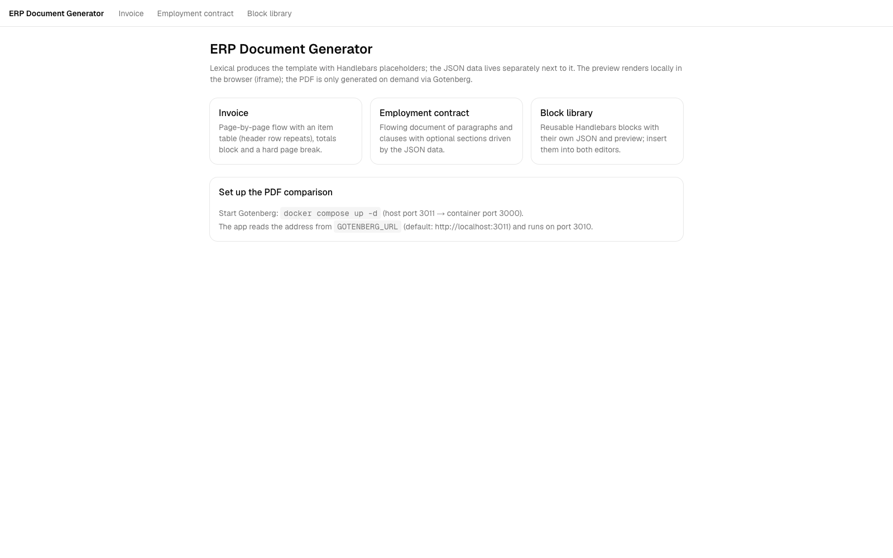
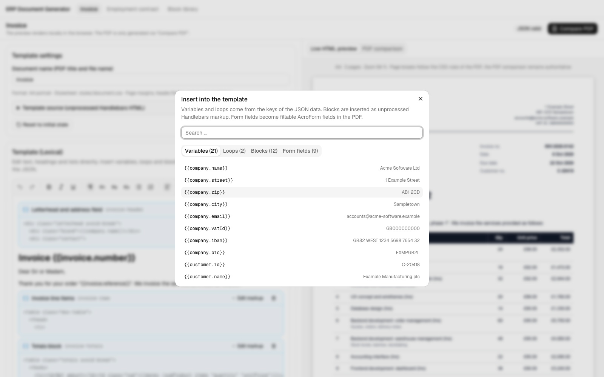
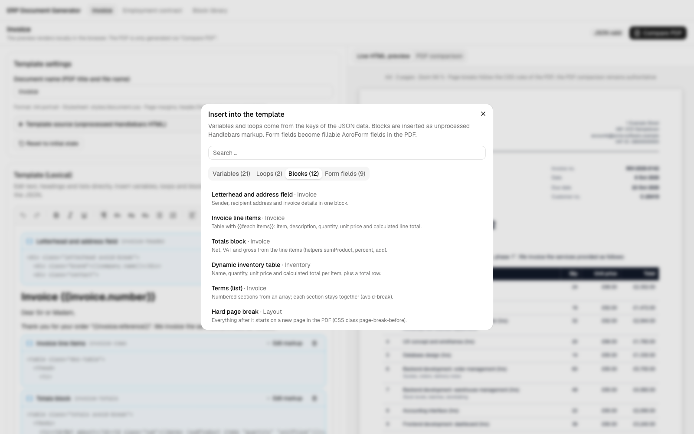
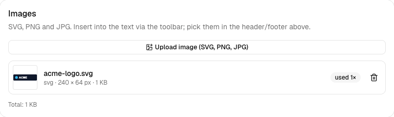
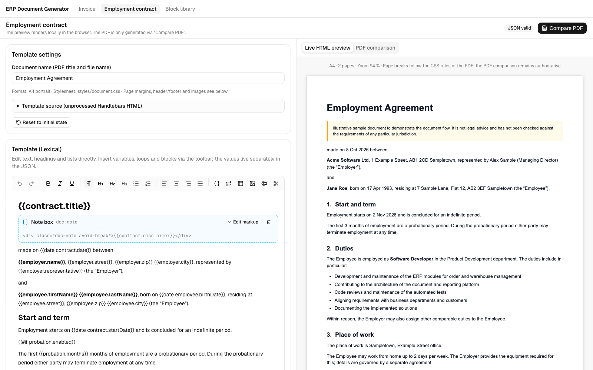
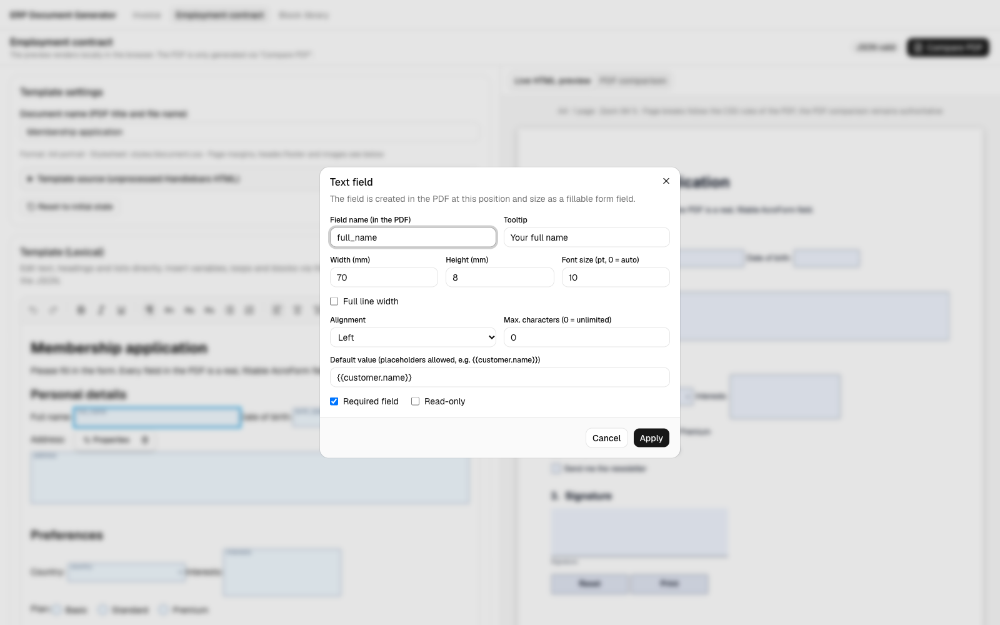
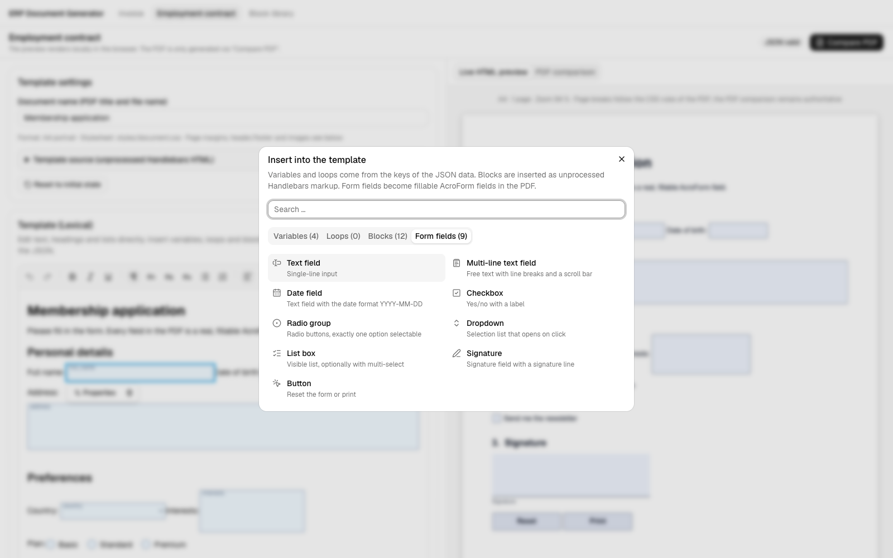
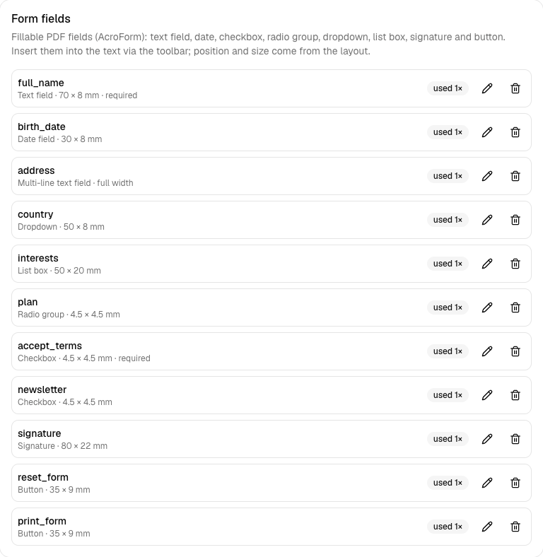

# docgen-kit demo (ERP document generator)

A Next.js application that shows what [docgen-kit](..) can do: a Lexical template editor, a live A4 preview, a block library, page layout (margins, header, footer, page number), images and fillable form fields, plus PDF comparison through Gotenberg.

The app contains only presentation code (shadcn/ui, Tailwind, the toolbar and dialogs) and sample content. Everything else comes from the library:

| Concern | Where it lives |
| --- | --- |
| PDF endpoint (`/api/generate-pdf`) | [`app/api/generate-pdf/route.ts`](app/api/generate-pdf/route.ts): 5 lines on top of `docgen-kit/server` |
| Live preview | `DocumentPreview` from `docgen-kit/react` (wrapped in [`A4IFramePreview`](components/preview/A4IFramePreview.tsx) for Tailwind styling) |
| Editor nodes, HTML import/export, sync | `templateNodes`, `TemplateHtmlPlugin`, `$importTemplateHtml` from `docgen-kit/react` |
| Node appearance (template block, image, form field) | [`components/editor/node-views.tsx`](components/editor/node-views.tsx), plugged in with `NodeViewsProvider` |
| Persistence in `localStorage` | `createDocumentStore` from `docgen-kit/client` ([`lib/document-store.ts`](lib/document-store.ts)) |
| Sample documents, example data, block data | [`lib/document-templates.ts`](lib/document-templates.ts), [`lib/mock-data.ts`](lib/mock-data.ts), [`lib/blocks.ts`](lib/blocks.ts) |

> **Note on sample data:** all names, companies, addresses, e-mail addresses, bank details and other data in this demo are **fictional**. Any resemblance to real persons, companies or other entities is coincidental and unintended. The sample employment agreement is illustrative only and not legal advice.

## Getting started

From the repository root:

```bash
npm install
docker compose -f demo/docker-compose.yml up -d   # Gotenberg: host port 3011 -> container port 3000
npm run demo                                       # builds the library, then http://localhost:3010
```

Or from this folder: `npm run dev` (it builds the library first). `GOTENBERG_URL` is read from `demo/.env.local` (template: `.env.example`, default `http://localhost:3011`).

While working on the library, run `npm run dev` in the repository root (tsup watch) and restart the Next.js dev server when you change the library.

## Pages

| Route | Content |
| --- | --- |
| `/editor` | Invoice: page-by-page flow, repeating table header, hard page break |
| `/editor/employment-contract` | Flowing employment agreement with optional sections (purely illustrative, no legal advice) |
| `/blocks` | Block library with its own JSON, live preview and insertion into both editors |

## Screenshots

| | |
| --- | --- |
|  |  |
| Home | Invoice editor with live A4 preview |
|  |  |
| Variables and loops derived from the JSON | Reusable Handlebars blocks |
|  |  |
| Margins, header, footer, page number | Image library (SVG, PNG, JPG) |
|  |  |
| Flowing contract with optional sections | Block library with its own JSON |
|  |  |
| Form fields in the editor and the preview | Field properties |
|  |  |
| Available field types | Field list of the document |

Example output generated by the app (all data is fictional):

- [invoice.pdf](../docs/examples/invoice.pdf), [employment-contract.pdf](../docs/examples/employment-contract.pdf), [form-demo.pdf](../docs/examples/form-demo.pdf) (with fillable AcroForm fields)
- [comparison.pdf](../docs/comparison.pdf): live preview (left) next to the Gotenberg PDF (right), page by page

## Gotenberg

`docker-compose.yml` starts `gotenberg/gotenberg:8` with JavaScript disabled and private IP ranges blocked, because templates are freely editable. The route requires `Content-Type: application/json` and limits the request size (12 MB, because of images); images, settings and form fields are validated again on the server.

## Scripts

| Command | Purpose |
| --- | --- |
| `npm run dev` | Build the library, then the development server on port 3010 |
| `npm run build` / `npm start` | Production build / server on port 3010 |
| `npm run lint` | ESLint |
